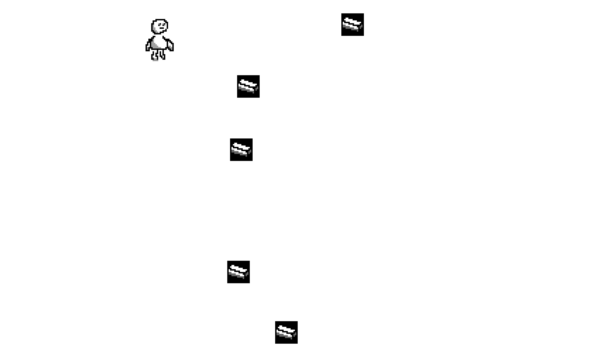

# (Brick Throw)

Author: (Sunny Fan)

Design: Silly game where you try to throw bricks at the lil guy.

Screen Shot:

How Your Asset Pipeline Works:

I only made a couple basic sprites for this, they are uploaded as pngs to /assets, then all converted to two .asset
files (one for the tiles, the other for palettes) using a Python script, which can be parsed for data by Load to store 
their information, which is later drawn in PlayMode.draw()

How To Play:

Use arrow keys:
Left/Right = move the brick you're holding
Up = throw the brick

try to hit the lil guy with the thrown bricks. That is all

This game was built with [NEST](NEST.md).

